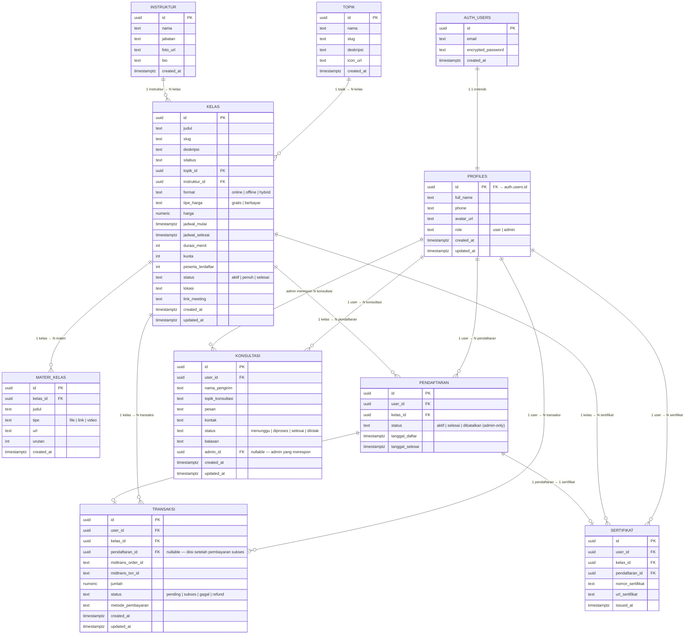

# 🗄️ ERD — TCC ITPLN Web Platform

> **Database Design Document (v1.0)**
> Dibuat: 2026-07-02 | Status: **Draft**
> Database: **PostgreSQL** via Supabase

---

## 1. Diagram ERD (Mermaid)



---

## 2. Deskripsi Tabel

### 2.1 `auth.users` *(Dikelola Supabase)*
Tabel internal Supabase Auth. Tidak dimodifikasi langsung — digunakan sebagai anchor untuk tabel `profiles`.

---

### 2.2 `profiles`
Ekstensi dari `auth.users`. Menyimpan data profil pengguna dan **role akses**.

| Kolom | Tipe | Keterangan |
|-------|------|------------|
| `id` | `UUID` PK | Sama dengan `auth.users.id` (FK + PK sekaligus) |
| `full_name` | `TEXT` | Nama lengkap pengguna |
| `phone` | `TEXT` | Nomor telepon (opsional) |
| `avatar_url` | `TEXT` | URL foto profil (dari Supabase Storage) |
| `role` | `TEXT` | `'user'` (default) atau `'admin'` |
| `created_at` | `TIMESTAMPTZ` | Waktu akun dibuat |
| `updated_at` | `TIMESTAMPTZ` | Waktu terakhir profil diperbarui |

> **Catatan:** Tabel ini dibuat otomatis via Supabase trigger saat user baru register (`auth.users` → insert → trigger → insert `profiles`).

---

### 2.3 `topik`
Kategori / bidang pelatihan yang tersedia di TCC.

| Kolom | Tipe | Keterangan |
|-------|------|------------|
| `id` | `UUID` PK | ID unik topik |
| `nama` | `TEXT` | Nama topik (contoh: "Kelistrikan Industri") |
| `slug` | `TEXT` UNIQUE | URL-friendly name (contoh: `kelistrikan-industri`) |
| `deskripsi` | `TEXT` | Deskripsi singkat topik |
| `icon_url` | `TEXT` | URL ikon topik (opsional) |
| `created_at` | `TIMESTAMPTZ` | Waktu dibuat |

---

### 2.4 `instruktur`
Data instruktur / pengajar yang terlibat di kelas TCC.

| Kolom | Tipe | Keterangan |
|-------|------|------------|
| `id` | `UUID` PK | ID unik instruktur |
| `nama` | `TEXT` | Nama lengkap instruktur |
| `jabatan` | `TEXT` | Jabatan / spesialisasi (contoh: "Ahli K3 Kelistrikan") |
| `foto_url` | `TEXT` | URL foto instruktur |
| `bio` | `TEXT` | Biografi singkat |
| `created_at` | `TIMESTAMPTZ` | Waktu data dibuat |

> **Catatan:** Instruktur **bukan** user sistem — mereka adalah data konten yang dikelola admin, tidak perlu login.

---

### 2.5 `kelas`
Entitas utama — menyimpan semua informasi kelas pelatihan.

| Kolom | Tipe | Keterangan |
|-------|------|------------|
| `id` | `UUID` PK | ID unik kelas |
| `judul` | `TEXT` | Judul kelas |
| `slug` | `TEXT` UNIQUE | URL-friendly name untuk routing `/kelas/[slug]` |
| `deskripsi` | `TEXT` | Deskripsi lengkap kelas |
| `silabus` | `TEXT` | Silabus / outline materi (bisa JSON atau Markdown) |
| `topik_id` | `UUID` FK | Referensi ke `topik.id` |
| `instruktur_id` | `UUID` FK | Referensi ke `instruktur.id` |
| `format` | `TEXT` | `'online'`, `'offline'`, atau `'hybrid'` |
| `tipe_harga` | `TEXT` | `'gratis'` atau `'berbayar'` |
| `harga` | `NUMERIC` | Nominal harga (0 jika gratis) |
| `jadwal_mulai` | `TIMESTAMPTZ` | Waktu mulai kelas |
| `jadwal_selesai` | `TIMESTAMPTZ` | Waktu selesai kelas |
| `durasi_menit` | `INT` | Total durasi dalam menit |
| `kuota` | `INT` | Batas maksimal peserta |
| `peserta_terdaftar` | `INT` | Counter peserta aktif — dikelola Go backend atomik (bukan trigger), lihat `06` §3 |
| `status` | `TEXT` | `'aktif'` / `'penuh'` / `'selesai'` |
| `lokasi` | `TEXT` | Lokasi fisik untuk kelas offline/hybrid (nullable) |
| `link_meeting` | `TEXT` | URL Zoom / Google Meet (untuk kelas online/hybrid) |
| `created_at` | `TIMESTAMPTZ` | Waktu kelas dibuat |
| `updated_at` | `TIMESTAMPTZ` | Waktu terakhir diperbarui |

---

### 2.6 `materi_kelas`
File, link, atau video yang dilampirkan ke sebuah kelas.

| Kolom | Tipe | Keterangan |
|-------|------|------------|
| `id` | `UUID` PK | ID unik materi |
| `kelas_id` | `UUID` FK | Referensi ke `kelas.id` |
| `judul` | `TEXT` | Nama / judul materi |
| `tipe` | `TEXT` | `'file'` / `'link'` / `'video'` |
| `url` | `TEXT` | URL file (Supabase Storage) atau link eksternal |
| `urutan` | `INT` | Urutan tampil materi dalam kelas |
| `created_at` | `TIMESTAMPTZ` | Waktu materi ditambahkan |

---

### 2.7 `pendaftaran`
Rekam jejak user yang mendaftar ke sebuah kelas (enrollment).

| Kolom | Tipe | Keterangan |
|-------|------|------------|
| `id` | `UUID` PK | ID unik pendaftaran |
| `user_id` | `UUID` FK | Referensi ke `profiles.id` |
| `kelas_id` | `UUID` FK | Referensi ke `kelas.id` |
| `status` | `TEXT` | `'aktif'` / `'selesai'` / `'dibatalkan'` |
| `tanggal_daftar` | `TIMESTAMPTZ` | Waktu pendaftaran dikonfirmasi |
| `tanggal_selesai` | `TIMESTAMPTZ` | Waktu kelas dinyatakan selesai untuk user ini |

> **Constraint:** `UNIQUE(user_id, kelas_id)` — satu user tidak bisa daftar kelas yang sama dua kali.
> **Validasi Jadwal:** Dilakukan di **backend (Go)** sebelum insert — cek apakah `jadwal_mulai` dan `jadwal_selesai` kelas baru overlap dengan kelas yang sudah diikuti user.
> **Aturan Cancel:** User **tidak bisa** membatalkan pendaftaran sendiri. Status `'dibatalkan'` hanya bisa diset oleh admin.
> **Akses Materi:** User yang statusnya `'selesai'` **tetap bisa mengakses materi** kelas — materi tidak dihapus setelah kelas berakhir.

---

### 2.8 `konsultasi`
Pengajuan konsultasi dari user kepada tim TCC.

| Kolom | Tipe | Keterangan |
|-------|------|------------|
| `id` | `UUID` PK | ID unik konsultasi |
| `user_id` | `UUID` FK | Referensi ke `profiles.id` (user pengirim) |
| `nama_pengirim` | `TEXT` | Nama pengirim (pre-fill dari profil, bisa diedit) |
| `topik_konsultasi` | `TEXT` | Topik / judul konsultasi |
| `pesan` | `TEXT` | Isi pesan / pertanyaan |
| `kontak` | `TEXT` | Email atau WA untuk dihubungi balik |
| `status` | `TEXT` | `'menunggu'` / `'diproses'` / `'selesai'` / `'ditolak'` |
| `balasan` | `TEXT` | Balasan dari admin (nullable) |
| `admin_id` | `UUID` FK | `profiles.id` admin yang merespon (nullable) |
| `created_at` | `TIMESTAMPTZ` | Waktu pengajuan dikirim |
| `updated_at` | `TIMESTAMPTZ` | Waktu terakhir status diperbarui |

---

### 2.9 `transaksi`
Rekam transaksi pembayaran kelas berbayar via Midtrans.

| Kolom | Tipe | Keterangan |
|-------|------|------------|
| `id` | `UUID` PK | ID unik transaksi internal |
| `user_id` | `UUID` FK | Referensi ke `profiles.id` |
| `kelas_id` | `UUID` FK | Referensi ke `kelas.id` |
| `pendaftaran_id` | `UUID` FK | Referensi ke `pendaftaran.id` (diisi setelah sukses) |
| `midtrans_order_id` | `TEXT` UNIQUE | Order ID yang dikirim ke Midtrans |
| `midtrans_txn_id` | `TEXT` | Transaction ID dari Midtrans (dari webhook) |
| `jumlah` | `NUMERIC` | Jumlah yang dibayar |
| `status` | `TEXT` | `'pending'` / `'sukses'` / `'gagal'` / `'refund'` |
| `metode_pembayaran` | `TEXT` | Diisi dari callback Midtrans (GoPay, BCA, dll) |
| `created_at` | `TIMESTAMPTZ` | Waktu transaksi dibuat |
| `updated_at` | `TIMESTAMPTZ` | Waktu terakhir status transaksi diperbarui |

---

### 2.10 `sertifikat`
Sertifikat yang diterbitkan setelah user menyelesaikan kelas.

| Kolom | Tipe | Keterangan |
|-------|------|------------|
| `id` | `UUID` PK | ID unik sertifikat |
| `user_id` | `UUID` FK | Referensi ke `profiles.id` |
| `kelas_id` | `UUID` FK | Referensi ke `kelas.id` |
| `pendaftaran_id` | `UUID` FK | Referensi ke `pendaftaran.id` |
| `nomor_sertifikat` | `TEXT` UNIQUE | Nomor seri sertifikat (contoh: `TCC-2026-0001`) |
| `url_sertifikat` | `TEXT` | URL file PDF sertifikat (Supabase Storage) |
| `issued_at` | `TIMESTAMPTZ` | Waktu sertifikat diterbitkan |

---

## 3. Relasi Antar Tabel

```
auth.users (1) ──────── (1) profiles
profiles   (1) ──────── (N) pendaftaran
profiles   (1) ──────── (N) konsultasi         [sebagai user pengirim]
profiles   (1) ──────── (N) konsultasi         [sebagai admin perespon]
profiles   (1) ──────── (N) transaksi
profiles   (1) ──────── (N) sertifikat

topik      (1) ──────── (N) kelas
instruktur (1) ──────── (N) kelas

kelas      (1) ──────── (N) materi_kelas
kelas      (1) ──────── (N) pendaftaran
kelas      (1) ──────── (N) transaksi
kelas      (1) ──────── (N) sertifikat

pendaftaran (1) ─────── (0..1) transaksi       [kelas berbayar saja]
pendaftaran (1) ─────── (0..1) sertifikat      [jika kelas sudah selesai]
```

---

## 4. Alur Data Kritis

### 4.1 Alur Pendaftaran Kelas Gratis
```
User klik "Daftar"
  → Backend validasi jadwal (tidak bentrok)
  → Enroll ATOMIK (1 transaksi DB, lihat 06 §3):
       UPDATE kelas +1 dgn guard kuota (0 baris → error KUOTA_PENUH)
       → INSERT pendaftaran (status: 'aktif')
  → Selesai — user langsung masuk kelas
```

### 4.2 Alur Pendaftaran Kelas Berbayar
```
User klik "Daftar"
  → Backend validasi jadwal
  → INSERT transaksi (status: 'pending')   [kuota BELUM diambil]
  → Redirect ke Midtrans Snap UI
       ↓ [User bayar]
  → Midtrans kirim webhook ke Go backend
  → Backend verifikasi webhook (signature + idempotency)
  → UPDATE transaksi (status: 'sukses')
  → Enroll ATOMIK: UPDATE kelas +1 dgn guard kuota → INSERT pendaftaran
       (0 baris = slot keburu habis → refund, lihat 08 §6.3)
  → UPDATE transaksi.pendaftaran_id
  → Selesai
```

### 4.3 Alur Penerbitan Sertifikat
```
Admin ubah pendaftaran.status = 'selesai'
  → Backend generate nomor sertifikat
  → Generate PDF → upload ke Supabase Storage
  → INSERT sertifikat
  → Notifikasi ke user (TBD)
```
> **TBD (Fase 8):** cara generate PDF belum diputuskan. Opsi termudah lebih dulu:
> template HTML → PDF (mis. `chromedp`/headless Chrome atau `maroto` di Go). Tunda
> keputusan lib sampai fase sertifikat — jangan pilih sekarang.

---

## 5. Constraint & Index Penting

| Tabel | Constraint / Index | Keterangan |
|-------|--------------------|------------|
| `profiles` | `role IN ('user', 'admin')` | Validasi nilai role |
| `kelas` | `format IN ('online', 'offline', 'hybrid')` | Validasi format |
| `kelas` | `tipe_harga IN ('gratis', 'berbayar')` | Validasi tipe harga |
| `kelas` | `status IN ('aktif', 'penuh', 'selesai')` | Validasi status kelas |
| `pendaftaran` | `UNIQUE(user_id, kelas_id)` | Cegah duplikat pendaftaran |
| `transaksi` | `UNIQUE(midtrans_order_id)` | Order ID Midtrans harus unik |
| `sertifikat` | `UNIQUE(nomor_sertifikat)` | Nomor seri harus unik |
| `topik` | `UNIQUE(slug)` | Slug topik unik |
| `kelas` | `UNIQUE(slug)` | Slug kelas unik |
| `kelas` | `INDEX(topik_id)` | Query filter by topik |
| `kelas` | `INDEX(format, status)` | Query filter listing kelas |
| `pendaftaran` | `INDEX(user_id)` | Query kelas saya |
| `transaksi` | `INDEX(user_id, status)` | Query riwayat transaksi |

---

## 6. Catatan Teknis

### Supabase Auth Integration
- Tabel `auth.users` sepenuhnya dikelola Supabase — jangan modifikasi langsung
- Buat **Database Trigger** di Supabase: saat row baru masuk ke `auth.users`, otomatis INSERT ke `profiles` dengan `role = 'user'`
- Gunakan **Supabase RLS (Row Level Security)** untuk membatasi akses data langsung dari frontend jika diperlukan

### UUID Generation
- Semua PK menggunakan `gen_random_uuid()` (PostgreSQL 13+)
- Tidak menggunakan auto-increment integer untuk keamanan dan kompatibilitas distributed system

### Soft Delete
- Tabel `kelas`, `konsultasi`, dan `pendaftaran` menggunakan field `status` untuk "soft delete" — data tidak dihapus permanen, hanya status diubah
- Hard delete hanya untuk `materi_kelas` dan `topik` yang tidak punya dependensi kritis

---

*Dokumen ini akan diperbarui seiring finalisasi skema database.*
