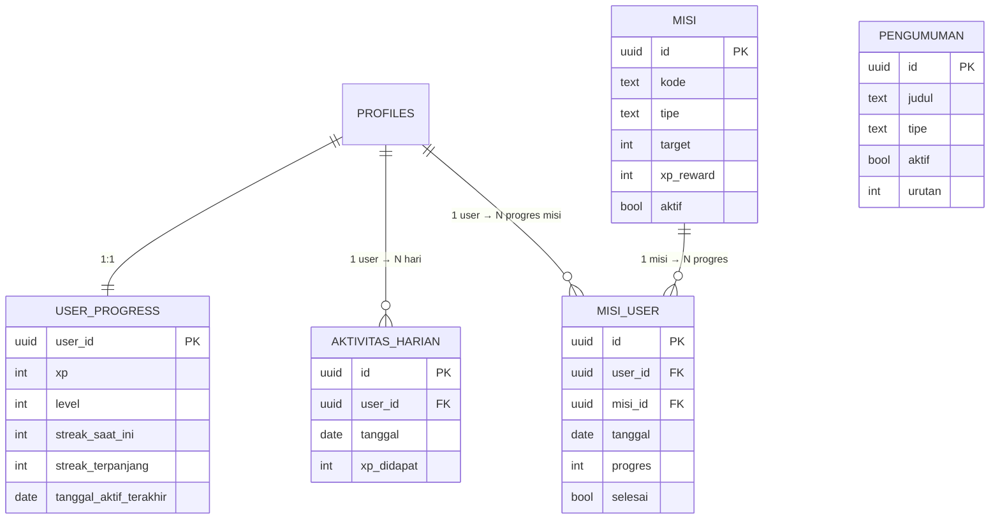

# Update 1 — Data Model untuk Dashboard Gamifikasi

> Tambahan skema (v1.0) | Dibuat: 2026-07-02 | Status: **Draft / usulan**
> Basis: mengikuti konvensi `02_erd_database.md` (snake_case Indonesia, UUID PK, `gen_random_uuid()`, CHECK enum, RLS).
> Tanpa emoji di seluruh dokumen & UI (aturan `01_project_plan.md` §6).

Dokumen ini merangkai **data apa saja yang perlu ada di database** supaya dashboard bisa tampil seperti referensi (screenshot SainsIn): banner pengumuman, kartu "Target Harian" (XP/level/streak), "Misi Hari Ini", dan daftar aktivitas.

---

## 0. Ringkasan: widget → tabel

Petakan tiap elemen di layar ke sumber datanya. Kolom "Status" menandai mana yang cocok langsung untuk platform training TCC, dan mana yang butuh subsistem baru.

| Widget di dashboard | Butuh data | Tabel baru | Status |
|---|---|---|---|
| Banner hijau/biru "UTBK dibuka" + kartu "Fitur Rilis" | Pengumuman terkelola admin | `pengumuman` | Cocok — mudah |
| "Target Harian" ring, `Lv 1 · 0 XP` | XP & level per user | `user_progress` | Cocok |
| "0/7 hari aktif minggu ini" + titik Sen–Min | Log aktif harian | `aktivitas_harian` | Cocok |
| "Misi Hari Ini 0/2 selesai" + baris misi | Definisi misi + progres user | `misi`, `misi_user` | Cocok |
| Lencana / pencapaian (opsional, tidak di SS) | Badge per user | `lencana`, `lencana_user` | Opsional |
| "Skor (Tryout terakhir)" + grafik | Nilai tryout historis | subsistem test-prep | **Terpisah** — lihat §6 |
| "Fokus (paling bisa naik)" | Subskor per kategori soal | subsistem test-prep | **Terpisah** — §6 |
| "0 Kuota Tryout Premium" / "Beli Paket" | Kuota paket berbayar | subsistem test-prep | **Terpisah** — §6 |
| Menu Try Out / Latihan / Drilling / Program | Bank soal, sesi, program | subsistem test-prep | **Terpisah** — §6 |

**Keputusan penting:** TCC ITPLN adalah platform **training & consulting**, bukan bimbel/test-prep. Bagian XP–streak–misi–pengumuman (§1–§4) menempel wajar di atas data yang sudah ada (`kelas`, `pendaftaran`, `materi_kelas`). Bagian test-prep (§6) adalah **produk terpisah yang besar** — jangan dibangun kecuali memang mau pivot ke arah itu. Sketsanya diberi di §6 supaya lengkap, tapi ditandai defer.

---

## 1. `user_progress` — XP, level, streak per user

Relasi 1:1 dengan `profiles`. Baris dibuat otomatis via trigger yang sama saat user register (extend trigger `profiles`).

| Kolom | Tipe | Keterangan |
|---|---|---|
| `user_id` | `UUID` PK/FK | = `profiles.id` |
| `xp` | `INT` | Total XP, default `0` |
| `level` | `INT` | Cache level, default `1` (diturunkan dari `xp`, lihat §5) |
| `streak_saat_ini` | `INT` | Jumlah hari aktif beruntun, default `0` |
| `streak_terpanjang` | `INT` | Rekor streak, default `0` |
| `tanggal_aktif_terakhir` | `DATE` | Hari aktif terakhir — dipakai hitung streak (nullable) |
| `updated_at` | `TIMESTAMPTZ` | default `now()` |

> `level` di-cache untuk baca murah; sumber kebenaran tetap `xp`. Backend recompute `level` setiap `xp` berubah.

---

## 2. `aktivitas_harian` — log hari aktif (sumber streak & titik Sen–Min)

Satu baris per user per hari user melakukan aktivitas apa pun (login + aksi bermakna). Ini sumber kebenaran untuk streak dan untuk deretan titik hari dalam seminggu.

| Kolom | Tipe | Keterangan |
|---|---|---|
| `id` | `UUID` PK | `gen_random_uuid()` |
| `user_id` | `UUID` FK | → `profiles.id` |
| `tanggal` | `DATE` | Hari aktivitas (zona waktu server, Asia/Jakarta) |
| `xp_didapat` | `INT` | Total XP hari itu, default `0` (opsional, untuk analitik) |
| `created_at` | `TIMESTAMPTZ` | default `now()` |

- **Constraint:** `UNIQUE(user_id, tanggal)` — satu baris per hari.
- **"7 hari aktif minggu ini":** `COUNT(*) WHERE user_id = $1 AND tanggal >= <senin minggu ini>`.
- **Titik Sen–Min:** ambil set `tanggal` di rentang minggu berjalan, tandai yang ada.
- **Streak:** dihitung backend saat user aktif — jika `tanggal_aktif_terakhir = kemarin` → `streak_saat_ini += 1`; jika `= hari ini` → tidak berubah; selainnya → reset ke `1`. Update `streak_terpanjang = max(...)`.

---

## 3. `misi` + `misi_user` — Misi Hari Ini

### 3.1 `misi` — definisi misi (dikelola admin/seed, jarang berubah)

| Kolom | Tipe | Keterangan |
|---|---|---|
| `id` | `UUID` PK | |
| `kode` | `TEXT` UNIQUE | Identifier stabil, contoh `buka_materi`, `daftar_kelas`, `selesaikan_kelas` |
| `judul` | `TEXT` | Contoh: "Buka satu materi kelas" |
| `deskripsi` | `TEXT` | Teks pendukung |
| `tipe` | `TEXT` | `'harian'` / `'mingguan'` / `'sekali'` |
| `target` | `INT` | Berapa kali aksi untuk selesai (contoh `5` soal, `1` kelas) |
| `xp_reward` | `INT` | XP saat misi selesai |
| `aktif` | `BOOLEAN` | default `true` |
| `created_at` | `TIMESTAMPTZ` | default `now()` |

> Untuk TCC, contoh misi yang realistis (bukan "drill soal"): `buka_materi` (buka 1 materi), `daftar_kelas` (daftar 1 kelas baru), `lengkapi_profil` (sekali), `ajukan_konsultasi`.

### 3.2 `misi_user` — progres misi per user per instance

| Kolom | Tipe | Keterangan |
|---|---|---|
| `id` | `UUID` PK | |
| `user_id` | `UUID` FK | → `profiles.id` |
| `misi_id` | `UUID` FK | → `misi.id` |
| `tanggal` | `DATE` | Instance misi (misi harian di-reset per tanggal) |
| `progres` | `INT` | default `0`, naik sampai `misi.target` |
| `selesai` | `BOOLEAN` | default `false` |
| `selesai_at` | `TIMESTAMPTZ` | nullable |
| `created_at` | `TIMESTAMPTZ` | default `now()` |

- **Constraint:** `UNIQUE(user_id, misi_id, tanggal)`.
- **"Misi Hari Ini 0/2 selesai":** `COUNT(*) FILTER (WHERE selesai) / COUNT(*)` untuk `tanggal = hari ini`.
- Baris dibuat lazy: saat user membuka dashboard, backend upsert baris misi harian untuk `misi` yang `aktif AND tipe='harian'` untuk hari ini.
- Saat `progres >= target` → set `selesai=true`, `selesai_at=now()`, dan tambahkan `xp_reward` ke `user_progress` (sekali).

---

## 4. `pengumuman` — banner & kartu info

Menggerakkan banner atas ("UTBK dibuka") dan kartu info kanan ("Fitur Drill Rilis"). Terkelola admin, tanpa deploy ulang.

| Kolom | Tipe | Keterangan |
|---|---|---|
| `id` | `UUID` PK | |
| `judul` | `TEXT` | Judul |
| `isi` | `TEXT` | Deskripsi singkat |
| `tipe` | `TEXT` | `'banner'` (lebar, atas) / `'info'` (kartu kecil, rail) |
| `label_aksi` | `TEXT` | Teks tombol, contoh "Isi survei" (nullable) |
| `url_aksi` | `TEXT` | Tujuan tombol (nullable) |
| `urutan` | `INT` | Urutan tampil, default `0` |
| `aktif` | `BOOLEAN` | default `true` |
| `mulai` | `TIMESTAMPTZ` | Tampil sejak (nullable) |
| `selesai` | `TIMESTAMPTZ` | Tampil sampai (nullable) |
| `created_at` | `TIMESTAMPTZ` | default `now()` |

- **Query dashboard:** `WHERE aktif AND (mulai IS NULL OR mulai <= now()) AND (selesai IS NULL OR selesai >= now()) ORDER BY urutan`.

---

## 5. Aturan XP & Level

**XP diberikan backend (Go) saat aksi bermakna** — bukan trigger DB, supaya idempoten & terkontrol (sejalan pola counter `kelas.peserta_terdaftar` di `06` §3).

Usulan tabel XP (kolom `xp` di `kelas`/`materi`), tunable:

| Aksi | XP | Catatan |
|---|---|---|
| Login/aktif pertama kali hari itu | `5` | sekali per hari, sekaligus catat `aktivitas_harian` |
| Selesaikan misi harian | `misi.xp_reward` | contoh `10` |
| Daftar kelas | `20` | sekali per pendaftaran |
| Selesaikan kelas (`pendaftaran.status='selesai'`) | `100` | |

**Formula level (sederhana, ganti sesukanya):**
```
level = 1 + floor(xp / 100)      -- tiap 100 XP naik 1 level
xp_ke_level_berikutnya = 100 - (xp mod 100)
```
Simpan `level` sebagai cache di `user_progress`; recompute tiap `xp` berubah.

> Opsional (belum perlu): tabel `xp_log` (ledger: `user_id`, `sumber`, `jumlah`, `ref_id`, `created_at`) kalau butuh audit/riwayat XP. YAGNI sampai ada kebutuhan menampilkan histori.

---

## 6. Subsistem test-prep (DEFER — hanya jika benar-benar mau)

Widget **Skor / Fokus / Try Out / Latihan / Drilling / Kuota / Program** di SS adalah fitur bimbel. Untuk mendukungnya butuh subsistem sendiri yang **jauh lebih besar** dari gamifikasi di atas dan berada di luar cakupan TCC saat ini. Sketsa singkat kalau memang mau ditempuh:

- `bank_soal` — soal, opsi, kunci, kategori/subtes, tingkat kesulitan.
- `paket_tryout` — kumpulan soal jadi satu tryout, jadwal, durasi.
- `sesi_pengerjaan` — 1 user mengerjakan 1 paket: mulai, selesai, skor total.
- `jawaban_user` — jawaban per soal per sesi (untuk skor & pembahasan).
- `skor_kategori` — subskor per subtes per sesi → menggerakkan grafik "Skor" & "Fokus (paling bisa naik)".
- `kuota_user` / paket premium — kuota tryout; pembelian lewat `transaksi` yang sudah ada + Midtrans (`08`).

**Rekomendasi (ponytail):** jangan bangun ini sekarang. TCC adalah training & consulting; grafik skor tryout tidak punya makna di sini. Kalau mau "feel" analitik tanpa test-prep, repurpose jadi **progres belajar** (mis. persen materi kelas yang sudah dibuka) — itu cukup dari `materi_kelas` + tabel `materi_progress(user_id, materi_id, dibuka_at)` sederhana, bukan seluruh mesin tryout.

---

## 7. DDL (PostgreSQL / Supabase)

Hanya bagian yang direkomendasikan (§1–§4). Test-prep (§6) tidak di-DDL-kan.

```sql
-- 1. user_progress (1:1 profiles)
CREATE TABLE user_progress (
    user_id                 UUID PRIMARY KEY REFERENCES profiles(id) ON DELETE CASCADE,
    xp                      INT NOT NULL DEFAULT 0 CHECK (xp >= 0),
    level                   INT NOT NULL DEFAULT 1 CHECK (level >= 1),
    streak_saat_ini         INT NOT NULL DEFAULT 0 CHECK (streak_saat_ini >= 0),
    streak_terpanjang       INT NOT NULL DEFAULT 0 CHECK (streak_terpanjang >= 0),
    tanggal_aktif_terakhir  DATE,
    updated_at              TIMESTAMPTZ NOT NULL DEFAULT now()
);

-- 2. aktivitas_harian (log hari aktif)
CREATE TABLE aktivitas_harian (
    id          UUID PRIMARY KEY DEFAULT gen_random_uuid(),
    user_id     UUID NOT NULL REFERENCES profiles(id) ON DELETE CASCADE,
    tanggal     DATE NOT NULL,
    xp_didapat  INT NOT NULL DEFAULT 0 CHECK (xp_didapat >= 0),
    created_at  TIMESTAMPTZ NOT NULL DEFAULT now(),
    UNIQUE (user_id, tanggal)
);
CREATE INDEX idx_aktivitas_user_tanggal ON aktivitas_harian (user_id, tanggal DESC);

-- 3a. misi (definisi)
CREATE TABLE misi (
    id          UUID PRIMARY KEY DEFAULT gen_random_uuid(),
    kode        TEXT NOT NULL UNIQUE,
    judul       TEXT NOT NULL,
    deskripsi   TEXT,
    tipe        TEXT NOT NULL CHECK (tipe IN ('harian','mingguan','sekali')),
    target      INT NOT NULL DEFAULT 1 CHECK (target >= 1),
    xp_reward   INT NOT NULL DEFAULT 0 CHECK (xp_reward >= 0),
    aktif       BOOLEAN NOT NULL DEFAULT true,
    created_at  TIMESTAMPTZ NOT NULL DEFAULT now()
);

-- 3b. misi_user (progres per instance)
CREATE TABLE misi_user (
    id          UUID PRIMARY KEY DEFAULT gen_random_uuid(),
    user_id     UUID NOT NULL REFERENCES profiles(id) ON DELETE CASCADE,
    misi_id     UUID NOT NULL REFERENCES misi(id) ON DELETE CASCADE,
    tanggal     DATE NOT NULL,
    progres     INT NOT NULL DEFAULT 0 CHECK (progres >= 0),
    selesai     BOOLEAN NOT NULL DEFAULT false,
    selesai_at  TIMESTAMPTZ,
    created_at  TIMESTAMPTZ NOT NULL DEFAULT now(),
    UNIQUE (user_id, misi_id, tanggal)
);
CREATE INDEX idx_misi_user_harian ON misi_user (user_id, tanggal);

-- 4. pengumuman
CREATE TABLE pengumuman (
    id          UUID PRIMARY KEY DEFAULT gen_random_uuid(),
    judul       TEXT NOT NULL,
    isi         TEXT,
    tipe        TEXT NOT NULL CHECK (tipe IN ('banner','info')),
    label_aksi  TEXT,
    url_aksi    TEXT,
    urutan      INT NOT NULL DEFAULT 0,
    aktif       BOOLEAN NOT NULL DEFAULT true,
    mulai       TIMESTAMPTZ,
    selesai     TIMESTAMPTZ,
    created_at  TIMESTAMPTZ NOT NULL DEFAULT now()
);
CREATE INDEX idx_pengumuman_aktif ON pengumuman (aktif, urutan);
```

### Trigger register (extend yang sudah ada)
Trigger `auth.users → profiles` di `06` ditambah satu insert:
```sql
INSERT INTO user_progress (user_id) VALUES (NEW.id);
```

---

## 8. RLS (Row Level Security)

| Tabel | Baca | Tulis |
|---|---|---|
| `user_progress` | user hanya baris sendiri (`user_id = auth.uid()`); admin semua | hanya backend (service role) |
| `aktivitas_harian` | user baris sendiri; admin semua | hanya backend |
| `misi` | semua user (read-only) | admin |
| `misi_user` | user baris sendiri; admin semua | hanya backend |
| `pengumuman` | semua user baca yang `aktif` | admin |

> XP/streak/misi **hanya ditulis backend Go** (service role), tidak pernah langsung dari klien — cegah user memalsukan XP. Pola sama seperti counter kelas di `06` §3.

---

## 9. Tambahan ERD (Mermaid)



---

## 10. Cakupan & urutan kerja

**Fase A (kecil, langsung dukung dashboard bergaya SS):**
1. `pengumuman` — banner & kartu info (paling cepat, bisa duluan, tanpa logika XP).
2. `user_progress` + `aktivitas_harian` — XP/level/streak + ring "Target Harian" & titik Sen–Min.
3. `misi` + `misi_user` — "Misi Hari Ini".

**Fase B (opsional):** `lencana` / `lencana_user` (badge).

**Defer / bukan cakupan TCC:** seluruh subsistem test-prep §6 (Skor, Fokus, Try Out, Drilling, Kuota). Bangun hanya jika memang pivot; kalau sekadar mau analitik, cukup `materi_progress` sederhana.

---

## 11. Endpoint API — konvensi

Mengikuti `03_api_contract.md`: base URL `…/api/v1`, header `Authorization: Bearer <supabase_jwt>`, envelope sukses `{ "success": true, "data": {…}, "message": "OK" }`, envelope error `{ "success": false, "error": "KODE", "message": "…" }`.

Level akses ditulis teks (tanpa emoji): **Public** / **User** (JWT valid) / **Admin** (JWT + role admin).

Prinsip desain (ponytail):
- **Satu endpoint agregat** `GET /me/dashboard` untuk render beranda sekali jalan — hindari 4–5 round-trip. Endpoint granular tetap ada untuk kebutuhan spesifik.
- **Klien tidak pernah menambah XP / progres misi secara langsung.** XP & misi hanya berubah sebagai *efek samping* aksi nyata di server (lihat §14). Ini mencegah pemalsuan XP, sejalan RLS "tulis hanya backend" (§8).
- **Hari aktif & streak dicatat otomatis** oleh middleware auth pada request terautentikasi pertama tiap hari — tidak ada endpoint "check-in" terpisah.

---

## 12. Endpoint User

| Method | Endpoint | Akses | Keterangan |
|---|---|---|---|
| `GET` | `/me/dashboard` | User | Agregat beranda: profil ringkas + progress + misi hari ini + pengumuman |
| `GET` | `/me/progress` | User | XP, level, streak, aktivitas minggu ini |
| `GET` | `/me/misi` | User | Misi hari ini + ringkasan (selesai/total) |
| `GET` | `/pengumuman` | Public | Pengumuman aktif (banner + info) |

### `GET /me/dashboard`
Panggilan utama beranda. Backend juga mencatat aktivitas hari ini (streak) sebagai bagian dari request ini.

**Response:**
```json
{
  "success": true,
  "data": {
    "profil": { "full_name": "Budi Santoso", "avatar_url": "https://..." },
    "progress": {
      "xp": 40,
      "level": 1,
      "xp_ke_level_berikutnya": 60,
      "streak_saat_ini": 3,
      "streak_terpanjang": 5,
      "hari_aktif_minggu_ini": 3,
      "aktivitas_minggu": [
        { "tanggal": "2026-06-29", "hari": "Sen", "aktif": true },
        { "tanggal": "2026-06-30", "hari": "Sel", "aktif": true },
        { "tanggal": "2026-07-01", "hari": "Rab", "aktif": false },
        { "tanggal": "2026-07-02", "hari": "Kam", "aktif": true },
        { "tanggal": "2026-07-03", "hari": "Jum", "aktif": false },
        { "tanggal": "2026-07-04", "hari": "Sab", "aktif": false },
        { "tanggal": "2026-07-05", "hari": "Min", "aktif": false }
      ]
    },
    "misi": {
      "selesai": 0,
      "total": 2,
      "items": [
        { "id": "uuid", "kode": "buka_materi", "judul": "Buka satu materi kelas",
          "target": 1, "progres": 0, "selesai": false, "xp_reward": 10 },
        { "id": "uuid", "kode": "daftar_kelas", "judul": "Daftar satu kelas baru",
          "target": 1, "progres": 0, "selesai": false, "xp_reward": 20 }
      ]
    },
    "pengumuman": [
      { "id": "uuid", "judul": "Katalog 2026 dibuka", "isi": "Jelajahi 100+ program baru.",
        "tipe": "banner", "label_aksi": "Lihat Katalog", "url_aksi": "/kelas" }
    ]
  }
}
```

### `GET /me/progress`
Subset `progress` dari `/me/dashboard` (untuk komponen ring yang refresh sendiri). Bentuk `data` = objek `progress` di atas.

### `GET /me/misi`
Bentuk `data` = objek `misi` di atas. Backend lazy-upsert baris `misi_user` untuk misi harian aktif jika belum ada untuk hari ini.

### `GET /pengumuman`
**Query Params:** `tipe` (opsional: `banner` / `info`).

**Response:**
```json
{
  "success": true,
  "data": [
    { "id": "uuid", "judul": "Katalog 2026 dibuka", "isi": "…",
      "tipe": "banner", "label_aksi": "Lihat Katalog", "url_aksi": "/kelas", "urutan": 0 }
  ]
}
```

---

## 13. Endpoint Admin

### 13.1 Kelola Misi

| Method | Endpoint | Akses | Keterangan |
|---|---|---|---|
| `GET` | `/admin/misi` | Admin | List semua definisi misi |
| `POST` | `/admin/misi` | Admin | Buat misi |
| `PUT` | `/admin/misi/:id` | Admin | Update misi |
| `DELETE` | `/admin/misi/:id` | Admin | Hapus misi (atau set `aktif=false`) |

**`POST /admin/misi` — Request Body:**
```json
{
  "kode": "buka_materi",
  "judul": "Buka satu materi kelas",
  "deskripsi": "Buka minimal satu materi hari ini",
  "tipe": "harian",
  "target": 1,
  "xp_reward": 10,
  "aktif": true
}
```
> `kode` unik & stabil — dipakai backend untuk mencocokkan aksi ke misi (§14). Mengubah `kode` misi yang sudah dipakai = memutus hook.

### 13.2 Kelola Pengumuman

| Method | Endpoint | Akses | Keterangan |
|---|---|---|---|
| `GET` | `/admin/pengumuman` | Admin | List semua (termasuk non-aktif) |
| `POST` | `/admin/pengumuman` | Admin | Buat pengumuman |
| `PUT` | `/admin/pengumuman/:id` | Admin | Update |
| `DELETE` | `/admin/pengumuman/:id` | Admin | Hapus |

**`POST /admin/pengumuman` — Request Body:**
```json
{
  "judul": "Katalog 2026 dibuka",
  "isi": "Jelajahi 100+ program baru.",
  "tipe": "banner",
  "label_aksi": "Lihat Katalog",
  "url_aksi": "/kelas",
  "urutan": 0,
  "aktif": true,
  "mulai": null,
  "selesai": null
}
```

> **Tidak ada endpoint tulis XP/streak/misi_user.** Nilai-nilai itu hanya berubah lewat efek samping §14. Admin melihat progress user (jika perlu) lewat `/admin/peserta/:id` yang sudah ada — tambahkan blok `progress` di responsnya bila diinginkan.

---

## 14. Hook XP & Misi — glue ke endpoint yang sudah ada

Ini bagian terpenting: XP dan progres misi **tidak punya endpoint sendiri**, tapi diperbarui sebagai efek samping dari endpoint yang sudah ada di `03`. Backend menjalankan langkah ini dalam transaksi DB yang sama dengan aksinya (atomik).

| Aksi (endpoint pemicu) | Efek XP | Misi yang di-increment (by `kode`) |
|---|---|---|
| Request terautentikasi pertama hari ini (middleware) | +5, upsert `aktivitas_harian`, update streak | — |
| `POST /pendaftaran` sukses (gratis / webhook berbayar) | +20 | `daftar_kelas` |
| `GET /kelas/:id/materi` (akses materi) | — | `buka_materi` |
| `PUT /auth/profile` melengkapi profil (nama+telepon terisi) | +15 sekali | `lengkapi_profil` (tipe `sekali`) |
| `POST /konsultasi` | — | `ajukan_konsultasi` |
| `PATCH /admin/pendaftaran/:id/status` → `selesai` | +100 ke user terkait | — |

**Prosedur increment misi (dipanggil backend saat aksi terjadi):**
```
1. Cari misi aktif dgn kode = <kode aksi>, tipe harian/mingguan/sekali.
2. Upsert misi_user (user, misi, tanggal instance) — progres += 1.
3. Jika progres >= target DAN belum selesai:
      selesai = true, selesai_at = now()
      user_progress.xp += misi.xp_reward   (sekali)
      recompute level; update streak/aktivitas bila perlu.
```
Idempoten: gunakan `UNIQUE(user_id, misi_id, tanggal)` + guard `selesai` agar reward tidak dobel. Pola sama dengan idempotency webhook Midtrans (`08`) dan counter kelas (`06` §3).

---

## 15. Kode error tambahan

Tidak ada kode error baru — cukup pakai yang di `03` (`UNAUTHORIZED`, `FORBIDDEN`, `NOT_FOUND`, `VALIDATION_ERROR`, `INTERNAL_ERROR`). Contoh:
- `kode` misi duplikat saat `POST /admin/misi` → `VALIDATION_ERROR` (422).
- User akses `/admin/misi` → `FORBIDDEN` (403).

---

## 16. Ringkasan endpoint baru

```
User:
  GET  /me/dashboard          agregat beranda (utama)
  GET  /me/progress           xp/level/streak/aktivitas
  GET  /me/misi               misi hari ini
  GET  /pengumuman            pengumuman aktif (Public)

Admin:
  GET|POST         /admin/misi
  PUT|DELETE       /admin/misi/:id
  GET|POST         /admin/pengumuman
  PUT|DELETE       /admin/pengumuman/:id

Tanpa endpoint (efek samping §14):
  XP, streak, aktivitas_harian, misi_user  → ditulis backend saja
```

> Endpoint di atas melengkapi §1–§4 (tabel) dan §7 (DDL). Test-prep §6 tetap defer. Kalau desain ini disetujui, langkah berikutnya: seed misi/pengumuman awal + implementasi (di luar dokumen perancangan ini).
